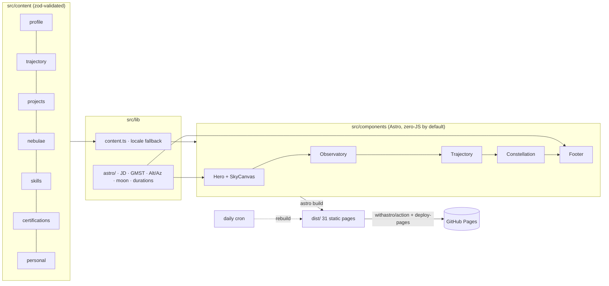

<p align="center">
  
</p>

<p align="center">
  <a href="https://rubo6.dev"></a>
  <a href="https://github.com/rubo6/rubo6.github.io/actions/workflows/deploy.yml"></a>
  <a href="https://github.com/rubo6/rubo6.github.io/actions/workflows/ci.yml"></a>
  <a href="https://github.com/rubo6/rubo6.github.io/actions/workflows/codeql.yml"></a>
  
  
  
  
</p>

<p align="center">
  <b>English</b> · <a href="https://rubo6.dev/es/">Español</a> · <a href="https://rubo6.dev/pt-br/">Português</a>
</p>

---

# Rubo · Observatory

**Live at [rubo6.dev](https://rubo6.dev)** (`rubo6.github.io` redirects there).

My personal site is an **observatory**. The hero renders the _real_ sky above Mexico City at the moment you open it, computed from a bright-star catalogue with sidereal-time math written in TypeScript and covered by unit tests. Projects live inside **nebulae**, each highlight is a **star**, my trajectory is drawn as **orbits**, and skills as **constellations**. A switch flips the whole universe from _professional_ to _personal_.

It is also a small engineering project: static output, content separated from presentation, security rules enforced by lint, no cookies or trackers (only a cookieless page count), and a repository designed so both humans and AI coding agents can extend it safely.

## What you will find on the site

| Section               | What it is                                                                                                                                                    | Where the data lives                                             |
| --------------------- | ------------------------------------------------------------------------------------------------------------------------------------------------------------- | ---------------------------------------------------------------- |
| **Sky**               | Live star map over CDMX (150 stars, 29 constellation figures), local sidereal clock, mission clocks (time at Mercado Libre, at ITAM, countdown to graduation) | `src/data/bright-stars.json`, `src/content/profile/*.json`       |
| **Observatory**       | Nebulae = project categories (modelled after Orion, Carina, Eagle, Helix, Lagoon, Horsehead). Stars = project highlights. Click to focus the telescope.       | `src/content/nebulae.json`, `src/content/projects/<locale>/*.md` |
| **Personal universe** | Same telescope pointed at me: astronomy, music, gaming, soft skills with evidence, fun facts                                                                  | `src/content/personal/*.json`                                    |
| **Trajectory**        | Work, leadership and education as orbits                                                                                                                      | `src/content/trajectory/*.json`                                  |
| **Skills**            | Constellations sized by proficiency; certifications in progress                                                                                               | `src/content/skills.json`, `src/content/certifications.json`     |
| **CV**                | Print-ready résumé generated from the same content, in three languages                                                                                        | `/cv`, `/es/cv`, `/pt-br/cv`                                     |

Two themes (**night** / **atlas**) × two modes (**professional** / **personal**), three languages (EN root, ES, PT-BR), `prefers-reduced-motion` respected everywhere.

## How it works



- **Astro 7** static output, i18n routing, View Transitions. No UI framework: the interactive bits (sky canvas, universe switch, observatory focus, live clocks) are small vanilla TypeScript modules in `src/scripts/`.
- **Tailwind CSS 4** as a Vite plugin. Design tokens are registered CSS `@property` values, so switching mode animates every colour instead of snapping. See [docs/DESIGN-SYSTEM.md](docs/DESIGN-SYSTEM.md).
- **Astronomy** is real: `src/lib/astro` implements Julian dates, Greenwich/local sidereal time, equatorial→horizontal transforms, a stereographic zenith projection and moon phase, validated against worked examples from Meeus (`tests/unit/astro.test.ts`).
- **No randomness.** Star dust, twinkle phases and layouts derive from an FNV-1a hash of their names, so every build is reproducible and `Math.random` is banned by lint.

## Edit content in 60 seconds

1. **Add a project:** copy any file in `src/content/projects/en/`, change the frontmatter (`key` must be unique and identical across locales), pick a `nebula`, list 1–8 `highlights`. Optionally add `es/` and `pt-br/` versions; missing locales fall back to English.
2. **Update a role or study:** edit `src/content/trajectory/<locale>.json`. `end: null` means "present" and keeps the live clock running.
3. **Change a date that drives a clock:** `src/content/profile/<locale>.json → dates`.
4. Run `npm run validate`. Schemas in `src/content.config.ts` will tell you exactly what is wrong.

Full guide: [docs/CONTENT-GUIDE.md](docs/CONTENT-GUIDE.md).

## Develop

```bash
npm install
npm run dev        # http://localhost:4321
npm run validate   # format · lint · types · tests · build (what CI runs)
npm run test:e2e   # Playwright smoke tests against the built site (desktop + mobile)
```

Requires Node ≥ 22.12 (see `.node-version`). Pushing to `main` deploys via GitHub Actions; a daily cron rebuilds so build-time data stays fresh.

## For AI agents

Start with [AGENTS.md](AGENTS.md). It defines the invariants (content vs. presentation, security rules, i18n, tone), the commands to run, and what _not_ to do. `CLAUDE.md` points there too. Architecture decisions are recorded in [docs/decisions](docs/decisions).

## Security

- Strict Content-Security-Policy via `<meta>`: no inline scripts; the only external origin is GoatCounter, a cookieless analytics service (ADR-0006).
- ESLint bans `eval`, `innerHTML`, `document.write`, `Math.random`.
- CI: format, lint, types, tests, build, `npm audit`, dependency review, CodeQL; Dependabot weekly; all actions pinned to commit SHAs with least-privilege permissions.
- No forms, no cookies, no phone number. Analytics are anonymous and cookieless. Contact is a professional e-mail only.
- Report an issue: see [SECURITY.md](SECURITY.md) or `/.well-known/security.txt`.

## Roadmap

- [ ] Official JWST / Hubble imagery per nebula (credited), with the procedural renderer as fallback
- [ ] Build-time GitHub loader: stars, forks, languages and last commit per repository
- [ ] Bitácora (blog) with MDX and RSS · "Now" page
- [ ] NASA APOD of the day at build time (secret-based, daily cron)
- [ ] Automated CV PDF in CI (Playwright print)
- [ ] Tier-2 locales (FR, DE, IT, JA, ZH) for UI strings and summaries
- [ ] Custom domain

## Credits

Type: [Fraunces](https://github.com/undercasetype/Fraunces), [Instrument Sans](https://github.com/Instrument/instrument-sans), [JetBrains Mono](https://www.jetbrains.com/lp/mono/) (self-hosted via Fontsource). Star data: hand-curated subset of the Yale Bright Star Catalogue. Astronomy formulas: Jean Meeus, _Astronomical Algorithms_.

## License

Code is MIT ([LICENSE](LICENSE)). Content in `src/content` (texts, CV data) is © Eduardo Rubén Bernal Puente, all rights reserved.
