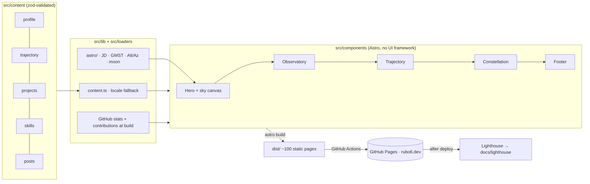

<p align="center">
  
</p>

<p align="center">
  <a href="https://rubo6.dev"></a>
  <a href="https://github.com/rubo6/rubo6.github.io/actions/workflows/deploy.yml"></a>
  <a href="https://github.com/rubo6/rubo6.github.io/actions/workflows/ci.yml"></a>
  <a href="https://github.com/rubo6/rubo6.github.io/actions/workflows/codeql.yml"></a>
  
  
  
  <a href="https://github.com/rubo6/rubo6.github.io/actions/workflows/lighthouse.yml"></a>
  <a href="https://github.com/rubo6/rubo6.github.io/actions/workflows/lighthouse.yml"></a>
  
</p>

<p align="center">
  <b>English</b> · <a href="https://rubo6.dev/es/">Español</a> · <a href="https://rubo6.dev/pt-br/">Português</a>
</p>

---

# Rubo · Observatory

**Live at [rubo6.dev](https://rubo6.dev).**

My personal site is an **observatory**. The hero renders the real sky above Mexico City at the moment you open it, computed from a bright-star catalogue with sidereal-time math written in TypeScript and covered by unit tests. Projects live inside **nebulae** (official JWST and Hubble imagery, credited), each highlight is a **star**, my trajectory is drawn as **orbits** with a camera that follows the entry you are reading, and skills as **constellations**. A switch flips the whole universe from _professional_ to _personal_.

It is also a small engineering project: static output, content separated from presentation, security rules enforced by lint, no cookies (only a cookieless page count), and a repository documented so that humans and AI coding agents, including small models, can extend it safely.

## On the site

| Section               | What it is                                                                                                     | Data                                                         |
| --------------------- | -------------------------------------------------------------------------------------------------------------- | ------------------------------------------------------------ |
| **Sky**               | Live star map over CDMX (150 stars, 29 constellation figures), local sidereal clock, mission clocks            | `src/data/bright-stars.json`, `src/content/profile/*.json`   |
| **Observatory**       | Nebulae = project categories, stars = project facts; click to focus the telescope                              | `src/content/nebulae.json`, `src/content/projects/<locale>/` |
| **Personal universe** | The informal half: astronomy, music, gaming, swimming, soft skills with evidence, GitHub contribution calendar | `src/content/personal/*.json`                                |
| **Trajectory**        | Work, leadership and education as orbits; institution details folded                                           | `src/content/trajectory/*.json`                              |
| **Skills**            | Constellations sized by proficiency, each star with its provenance; certifications                             | `src/content/skills.json`, `src/content/certifications.json` |
| **Log** and **Now**   | Study log by term with filters and RSS; what I am doing this month                                             | `src/content/posts/<locale>/`, `src/content/now/*.json`      |
| **CV**                | Print-ready, parser-friendly résumé generated from the same content, in three languages                        | `/cv`, `/es/cv`, `/pt-br/cv`                                 |

Two themes (**night** / **atlas**) × two modes (**professional** / **personal**), three languages (EN root, ES, PT-BR), `prefers-reduced-motion` respected everywhere.

## How it works



- **Astro 7** static output, i18n routing, view transitions. Interactive parts are small vanilla TypeScript modules in `src/scripts/`.
- **Tailwind CSS 4** as a Vite plugin; design tokens are registered CSS `@property` values so a mode switch interpolates every colour.
- **Real astronomy** in `src/lib/astro` (Julian dates, sidereal time, equatorial→horizontal, stereographic projection, moon phase) validated against Meeus.
- **No randomness**: star dust and twinkle phases derive from an FNV-1a hash, so every build is reproducible.

## Edit content

```bash
npm run new -- project <key>   # scaffolds EN/ES/PT-BR with TODO markers
npm run new -- post <key>      # scaffolds a log entry
npm run validate               # schemas tell you exactly what is wrong
```

Guide with an example per collection: [docs/CONTENT.md](docs/CONTENT.md).

## Develop

```bash
npm install
npm run dev        # http://localhost:4321
npm run validate   # format · lint · types · tests · content check · build (what CI runs)
npm run test:e2e   # Playwright smoke tests against the built site
```

Node 24 (`.node-version`). Pushing to `main` deploys; a daily cron rebuilds so build-time data stays fresh; Lighthouse runs on a GitHub runner after each deploy.

## For AI agents

Start with [AGENTS.md](AGENTS.md): it maps each kind of task to the single document to read, and lists the invariants, voice rules and what must never be published. Decisions are in [docs/decisions](docs/decisions).

## Security

- Strict Content-Security-Policy via `<meta>`: no inline scripts; the only external origin is GoatCounter, a cookieless analytics service.
- ESLint bans `eval`, `innerHTML`, `document.write`, `Math.random`.
- CI: format, lint, types, tests, build, `npm audit`, dependency review, CodeQL; Dependabot weekly; all actions pinned to commit SHAs with least-privilege permissions.
- No forms, no cookies, no phone number. Report an issue: [SECURITY.md](SECURITY.md) or `/.well-known/security.txt`.

## Credits

Type: [Fraunces](https://github.com/undercasetype/Fraunces), [Instrument Sans](https://github.com/Instrument/instrument-sans), [JetBrains Mono](https://www.jetbrains.com/lp/mono/) (self-hosted via Fontsource). Star data: hand-curated subset of the Yale Bright Star Catalogue. Astronomy formulas: Jean Meeus, _Astronomical Algorithms_. Imagery: ESA/Webb and ESA/Hubble releases (CC BY 4.0), credited in place.

## License

Code is MIT ([LICENSE](LICENSE)). Content in `src/content` (texts, CV data) is © Eduardo Rubén Bernal Puente, all rights reserved.
